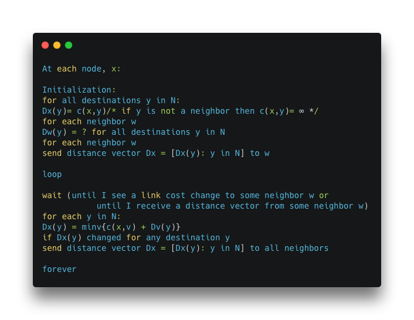
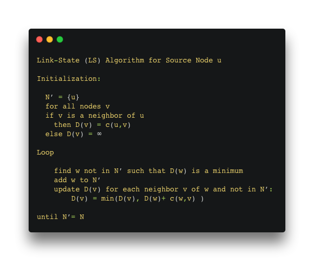

# Routing Algorithms

 In this project, we implemented Distance Vector Algorithm and Link State Algorithm, which should be able to run over a network simulator. In addition, this project gave me an understanding of how OSPF and BGP work.
  
## Prerequisites

Install all of these libraries:

``` 
pip install --user networkx matplotlib
```

  if you find any error in the above command run this one:
  
```
pip3 install --user networkx matplotlib
 ```
## To run the code

To execute any of the algorithm run this command:
```
python3 sim.py GENERIC [eventfile]
```
To run only distance vector algorithm:
```
python3 sim.py DISTANCE_VECTOR [eventfile]
```

To run only Link State algorithm:
```
python3 sim.py LINK_STATE [eventfile]
```
## General approach how to implement an routing algorithm is:

```
1. Run routesim with type GENERIC to see how it works.
2. Read demo.event and test1.event to learn the event file format.
3. Read the generic_node.py, distance_vector_node.py and link_state_node.py to understand what functions you'll be implementing.
4. Decide what data must be stored by each node in the node class, for the particular algorithm you are implementing. It should also be updatable, as its contents willchange with the arrival of link updates and routing messages.
5. Implement get_next_hop() toreturn the appropriate answer, based on what the node currently knows.
6. Develop your routing message. Think about where your routing message will go. There aresubtleties involved in flooding, in particular.
7. Implement link_has_been_updated(). You must record the new information within the node, and (depending on the message contents) you may need to send messages to neighbors.
8. Implement process_incoming_routing_message(). As above, you must record the new information within the node, and (depending on the message contents) you may need to send messages to neighbors.
```

## Distance Vector Algorithm



## Link State Algorithm


